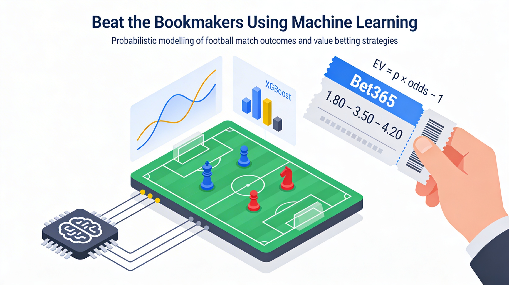

# Beat the Bookmakers Using Machine Learning



Probabilistic modelling of football match outcomes and value betting strategies using historical match data and bookmaker odds.

## Project Overview

This project follows the assignment brief in [instructions.pdf](instructions.pdf) and implements the full pipeline described in [analyses.ipynb](analyses.ipynb):

1. **Match-level dataset construction**  
   - Load `Match`, `League`, `Team` tables  
   - Keep **Premier League** and **Ligue 1**  
   - Create `result ∈ {H, D, A}`  
   - Keep Bet365 odds and compute margin-adjusted implied probabilities  

2. **Feature engineering**  
   - Team form features (rolling last *N* matches)  
   - Team attributes from `Team_Attributes`  
   - Home/away differences  

3. **Modeling**  
   - Multinomial Logistic Regression  
   - XGBoost (with/without odds)  
   - Calibration (isotonic)  

4. **Bet embedding & EV computation**  
   - Build a “bets” table (match × outcome)  
   - Compute $EV = p \times odds - 1$  

5. **Strategies & backtesting**  
   - R1 / R2 / R3 strategies  
   - Ultra‑conservative filters  
   - Confidence filter vs market  

6. **Optimization**  
   - Linear programming allocation over value bets  

7. **Results export**  
   - Figures and tables in [results/](results/)

## Database Schema

You can view the database schema here: [db_diagram.pdf](db_diagram.pdf).

## Repository Structure

```
.
├── README.md         : Project overview, instructions, and how to run
├── analyses.ipynb    : Main analysis notebook (English)
├── cover_project.png : Cover image used at the top of this README
├── (database.sqlite) : SQLite database (required; excluded from Git due to size)
├── db_diagram.pdf    : Database schema diagram
├── instructions.pdf  : Assignment brief and requirements
├── report.pdf        : Final written report
├── requirements.txt  : Python dependencies
└── results           : Exported figures and tables
    ├── fig_*.png     : Generated figures
    └── table_*.csv   : Generated result tables
```

## How to Run

1. Create a Python environment and install dependencies from [requirements.txt](requirements.txt).
2. Run the analysis notebooks: [analyses.ipynb](analyses.ipynb)

> Note: the SQLite database file `database.sqlite` is required but excluded from Git due to size. You can download it from the [European Soccer Database (Kaggle)](https://www.kaggle.com/datasets/hugomathien/soccer) page and place it in the project root.

## Outputs

- Figures: `results/fig_*.png`  
- Tables: `results/table_*.csv`  

## Report

The final report is available as [report.pdf](report.pdf).